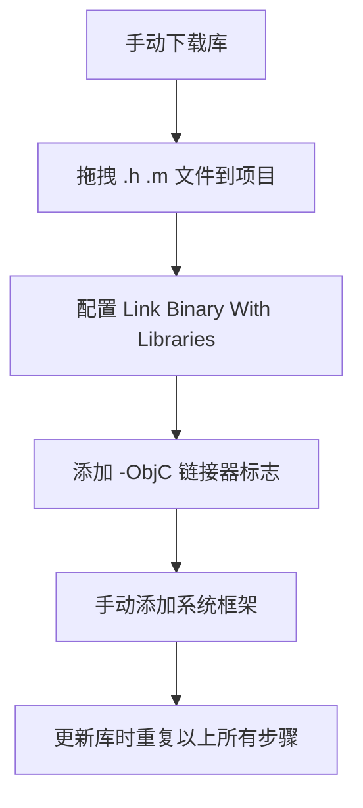

从零开始给你讲清楚 CocoaPods 的前因后果和用法。

---

## 📖 一、什么是 CocoaPods？

**CocoaPods 是 iOS/macOS 开发的依赖管理工具**，类似于：
- JavaScript 的 `npm`
- Java 的 `Maven`
- Python 的 `pip`

它的作用就是帮你**自动管理第三方库**。

---

## 🤔 二、为什么需要 CocoaPods？（前因）

### 在没有 CocoaPods 的年代（2011年以前）

假设你的项目需要用到 AFNetworking、SDWebImage、Masonry 三个库：



**痛点：**
1. 🔽 **下载麻烦**：要去 GitHub 找下载链接
2. 📁 **添加麻烦**：要手动拖文件到 Xcode
3. 🔗 **配置麻烦**：要设置链接器、添加系统框架
4. 📦 **依赖麻烦**：库 A 依赖库 B，你要自己搞清楚并手动添加
5. 🔄 **更新麻烦**：库有新版本，要重复所有步骤
6. 🗑️ **删除麻烦**：想移除一个库，要手动删文件、删配置

---

## 🚀 三、CocoaPods 做了什么？（后果）

### 现在用 CocoaPods，只需要：

1. **写一个 Podfile**，告诉它你要用什么库
2. **执行 `pod install`**
3. **打开 `.xcworkspace` 开始开发**

```ruby
# Podfile - 就这么简单
platform :ios, '10.0'

target 'MyApp' do
  pod 'AFNetworking'
  pod 'SDWebImage'
  pod 'Masonry'
end
```

然后 CocoaPods 自动帮你完成：
- ✅ 下载所有库的源代码
- ✅ 处理库之间的依赖关系
- ✅ 配置 Xcode 编译设置
- ✅ 创建 workspace 整合你的项目和库
- ✅ 版本锁定，确保团队一致

---

## 🏗️ 四、CocoaPods 的核心概念

### 1. Podfile - 配置文件

这是你唯一需要手写的文件，定义项目要用的库。

```ruby
# 基础结构
platform :ios, '10.0'           # 最低支持版本

target 'MyApp' do               # 针对哪个 target
  use_frameworks!               # 使用 framework（Swift 需要）
  
  pod 'AFNetworking'            # 最新版本
  pod 'SDWebImage', '~> 5.0'    # 版本约束
  pod 'Masonry', '1.1.0'        # 指定版本
  pod 'Alamofire', :git => 'https://github.com/Alamofire/Alamofire.git'  # 指定 Git 地址
end
```

### 2. Podfile.lock - 版本锁定文件

自动生成，**必须提交到 Git**。作用：
- 锁定每个库的精确版本
- 确保团队所有人用的版本一致
- 避免"在我电脑上能运行"的问题

### 3. Pods/ 文件夹 - 库的代码存放处

自动生成，**不提交到 Git**。里面是：
- 所有第三方库的源代码
- 编译配置
- 生成的 framework

### 4. .xcworkspace - 工作空间

自动生成，**提交到 Git**。以后就用它打开项目，而不是 `.xcodeproj`。

```
原来：打开 MyApp.xcodeproj
现在：打开 MyApp.xcworkspace  ⭐
```

---

## 📂 五、文件结构对比

### 使用 CocoaPods 前：
```
MyApp/
├── MyApp.xcodeproj/
├── MyApp/
│   ├── ViewController.m
│   └── ...
└── 第三方库/           ❌ 手动管理，乱七八糟
    ├── AFNetworking/   ❌ 手拖进来的
    └── SDWebImage/     ❌ 手拖进来的
```

### 使用 CocoaPods 后：
```
MyApp/
├── MyApp.xcodeproj/           # 原始项目（基本不用了）
├── MyApp.xcworkspace/         # ⭐ 用这个打开
├── Podfile                    # ✅ 你写的配置
├── Podfile.lock               # 自动生成，提交 Git
├── Pods/                      # 自动生成，不提交 Git
│   ├── AFNetworking/          # ✅ 自动下载的源码
│   ├── SDWebImage/            # ✅ 自动下载的源码
│   ├── Headers/
│   ├── Target Support Files/  # Xcode 配置
│   └── Pods.xcodeproj/        # 库的项目文件
└── MyApp/                     # 你的代码
    └── ViewController.m
```

---

## 🔄 六、常用命令详解

| 命令 | 什么时候用 | 做什么 |
|------|-----------|--------|
| `pod install` | **第一次使用**<br>添加/删除库后 | 安装所有依赖，生成 `.xcworkspace` |
| `pod update` | 想升级所有库到最新版本 | 更新 Podfile.lock 中的版本 |
| `pod update [库名]` | 只想升级某个库 | 只更新指定的库 |
| `pod outdated` | 检查哪些库有新版本 | 列出可更新的库 |
| `pod deintegrate` | 想完全移除 CocoaPods | 删除所有 CocoaPods 生成的文件 |

### 重要区别：
```
pod install   → 尊重 Podfile.lock，只在 Podfile 变化时更新
pod update    → 忽略 Podfile.lock，更新到最新允许版本
```

**日常工作流程：**
```bash
# 1. 第一次拉取代码
git clone xxx
pod install          # 安装所有依赖

# 2. 添加新库后
# 编辑 Podfile，添加新库
pod install          # 安装新库，其他库版本不变

# 3. 想升级所有库
pod outdated         # 先看看有哪些可以升级
pod update           # 全部升级
```

---

## 🎯 七、实战演示：从零开始

### 步骤 1：创建项目
```bash
# 在 Xcode 创建新项目，名为 "MyDemo"
```

### 步骤 2：安装 CocoaPods
```bash
# 如果还没安装
sudo gem install cocoapods
```

### 步骤 3：进入项目目录，初始化
```bash
cd /Users/xxx/MyDemo
pod init
```
这会生成一个 Podfile 模板

### 步骤 4：编辑 Podfile
```ruby
# 用文本编辑器打开 Podfile
platform :ios, '13.0'

target 'MyDemo' do
  use_frameworks!
  
  pod 'Alamofire'           # 网络库
  pod 'Kingfisher'          # 图片加载
  pod 'SnapKit'             # 自动布局
end
```

### 步骤 5：安装
```bash
pod install
```

### 步骤 6：开始开发
```bash
# 打开 workspace（注意不是 xcodeproj！）
open MyDemo.xcworkspace
```

### 步骤 7：在代码中使用
```swift
// 现在可以直接 import 了
import Alamofire
import Kingfisher
import SnapKit

class ViewController: UIViewController {
    override func viewDidLoad() {
        super.viewDidLoad()
        
        // 直接使用 Alamofire
        AF.request("https://api.example.com").response { response in
            print(response)
        }
    }
}
```

---

## 📊 八、版本号规则（语义化版本）

CocoaPods 使用语义化版本：`主版本.次版本.补丁版本`

| 写法 | 含义 | 例子（当前最新 5.8.0） |
|------|------|----------------------|
| `'5.8.0'` | 精确版本 | 只安装 5.8.0 |
| `'~> 5.8.0'` | 补丁版本可更新 | 5.8.0 → 5.8.3，不会到 5.9.0 |
| `'~> 5.8'` | 次版本可更新 | 5.8.0 → 5.9.0，不会到 6.0.0 |
| `'>= 5.0'` | 大于等于 5.0 | 最新版本 |
| `:branch => 'dev'` | 指定 Git 分支 | 用开发分支 |

---

## 🎓 九、常见问题

### Q1: 为什么打开项目要用 `.xcworkspace` 而不是 `.xcodeproj`？
因为 CocoaPods 创建了一个包含你项目和 Pods 项目的 workspace。用 xcodeproj 打开，Pods 库不会被加载，编译会失败。

### Q2: Pods 文件夹要提交到 Git 吗？
**不提交**。在 `.gitignore` 中加上：
```
Pods/
```
因为可以通过 Podfile 和 Podfile.lock 重建。

### Q3: Podfile.lock 要提交吗？
**必须提交**。这样才能保证团队成员用的版本一致。

### Q4: 为什么 `pod install` 很慢？
第一次会很慢，因为要下载整个索引仓库（几百 MB）。后续就快了。如果很慢，可以用 CDN：
```ruby
# Podfile 第一行加上
source 'https://cdn.cocoapods.org/'
```

---

## 📝 十、总结

```
没有 CocoaPods 前：
手动下载 → 手动拖拽 → 手动配置 → 手动管理依赖 → 手动更新
      ↑                                       ↓
      └──────────────── 噩梦循环 ────────────────┘

有了 CocoaPods：
写 Podfile → pod install → 开始开发
   ↑            ↓
   └── 只需要操心这个
```

**核心理念：**
- CocoaPods 是 iOS 开发的"应用商店"管理器
- 你只需要告诉它你要什么（Podfile），它帮你搞定一切
- 团队协作时，用 Podfile.lock 保证版本一致
- 以后开发，记得用 `.xcworkspace` 打开项目

-----------------------------------------------------------------------------

### 📂 Products
```
01-网易新闻       ← 你的 App 编译后的产物（.app 文件）
```
这就是最终编译生成的应用程序。

### 📂 Pods
```
Pods-01-网易新闻.debug      ← Debug 模式的构建配置
Pods-01-网易新闻.release    ← Release 模式的构建配置
```
这两个是 CocoaPods 自动生成的 `.xcconfig` 配置文件，分别对应两种编译模式：
- **debug** — 开发调试用，包含调试符号，不优化代码
- **release** — 发布上线用，优化代码，去掉调试信息

它们的作用是告诉 Xcode 在编译时去哪里找 Pod 的头文件、库文件等。

### 📂 Frameworks
```
libPods-01-网易新闻.a       ← AFNetworking 编译后的静态库
```
这是 CocoaPods 把 AFNetworking 的所有源码编译打包后生成的**静态库文件**（`.a` 文件）。你的项目链接这个 `.a` 文件就能使用 AFNetworking 的功能了。

### 整个流程简单来说：

```
AFNetworking 源码
       ↓ 编译
libPods-01-网易新闻.a（静态库）
       ↓ 链接
01-网易新闻.app（你的应用）
```

Xcode 编译时会先把 Pods 里的 AFNetworking 源码编译成 `.a` 静态库，然后你的主项目链接这个静态库，最终打包成 `.app`。