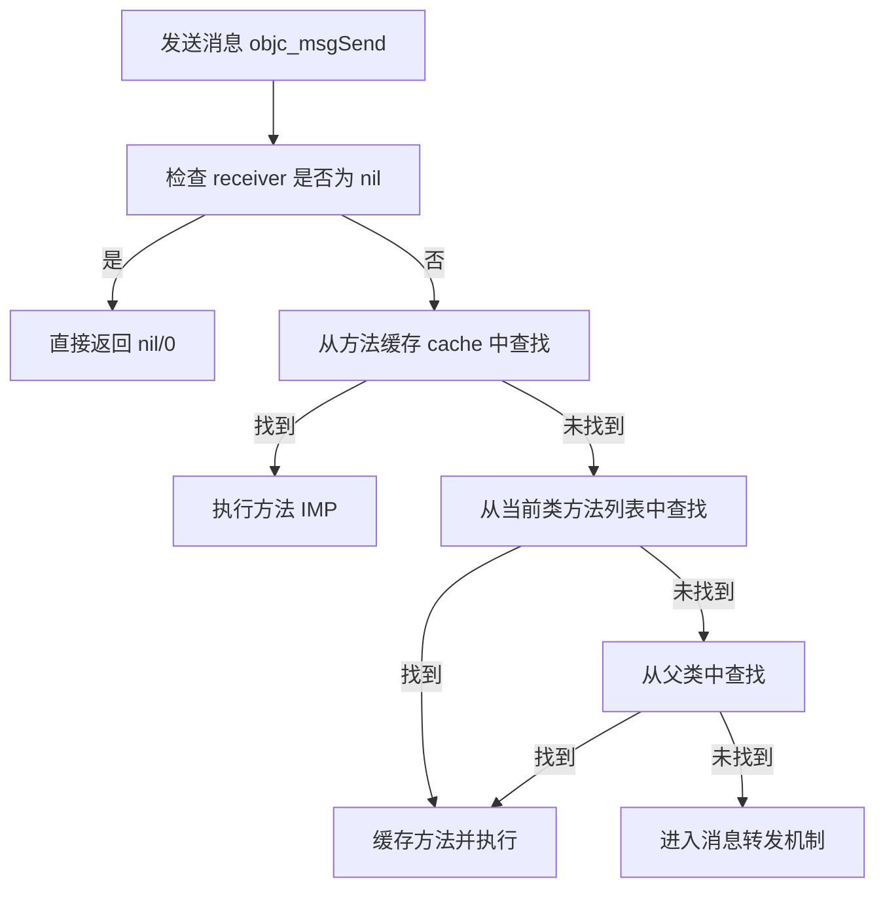

# Objective-C 消息机制详解

## 🎯 一句话概括

**Objective-C 的消息机制就是：方法调用实际上是向对象发送消息，而不是直接调用函数。**

## 🔍 核心概念对比

### C/C++/Java（函数调用）：
```c
// C语言：直接函数调用，编译时确定
obj->function(arg);  // 编译时就知道调用哪个函数
```

### Objective-C（消息发送）：
```objective-c
// Objective-C：动态消息发送，运行时确定
[obj message:arg];  // 编译时不知道，运行时才查找要执行的方法
```

## 📖 消息发送的完整过程

### 步骤图解：
```
[receiver message:argument]
        ↓
1. 编译器转换为：objc_msgSend(receiver, selector, argument)
        ↓
2. 在 receiver 的类中查找 selector 对应的方法实现
        ↓
3. 如果找到，执行方法实现
        ↓
4. 如果没找到，进入消息转发机制
```

## 💻 代码示例详解

### 示例1：基础消息发送
```objective-c
// 你写的代码：
Person *person = [[Person alloc] init];
[person sayHello];

// 编译器实际转换为：
objc_msgSend(person, @selector(sayHello));

// objc_msgSend 是汇编写的，非常高效！
// 它在运行时查找 person 对象中 sayHello 方法的实现
```

### 示例2：带参数的消息
```objective-c
// 你写的代码：
[person setName:@"张三" age:25];

// 编译器转换为：
objc_msgSend(person, @selector(setName:age:), @"张三", 25);
```

## 🏗️ 底层数据结构

### 1. **objc_object（每个对象都有）**
```c
struct objc_object {
    Class isa;  // 指向对象所属的类
};
```

### 2. **objc_class（类的结构）**
```c
struct objc_class {
    Class isa;                    // 元类指针
    Class super_class;            // 父类指针
    const char *name;             // 类名
    long version;                 // 版本信息
    long info;                    // 类信息
    long instance_size;           // 实例大小
    struct objc_ivar_list *ivars; // 实例变量列表
    struct objc_method_list **methodLists;  // 方法列表 ← 关键！
    struct objc_cache *cache;     // 方法缓存 ← 性能关键！
    struct objc_protocol_list *protocols; // 协议列表
};
```

## 🔄 消息查找流程（详细）



### 详细步骤：

#### 步骤1：**检查 receiver 是否为 nil**
```objective-c
// 如果 receiver 为 nil，什么也不做，直接返回
// 这就是为什么向 nil 发送消息不会崩溃
[nil doSomething];  // 安全，什么都不发生
```

#### 步骤2：**查找方法缓存**
```objective-c
// 每个类都有一个方法缓存（objc_cache）
// 缓存最近使用过的方法，提高查找速度
// 缓存命中率通常 >90%，这就是 ObjC 高效的原因
```

#### 步骤3：**查找当前类的方法列表**
```objective-c
// 如果缓存未命中，在当前类的方法列表中查找
// 方法列表是一个哈希表，查找速度很快
```

#### 步骤4：**查找父类链**
```objective-c
// 如果当前类没找到，沿着继承链向父类查找
// 直到 NSObject（根类）
```

#### 步骤5：**消息转发机制**
```objective-c
// 如果整个继承链都没找到，进入消息转发
// 这是 Objective-C 最强大的特性之一
```

## 🚀 消息转发机制（Method Forwarding）

### 消息转发的三个阶段：

#### 阶段1：**动态方法解析（Dynamic Method Resolution）**
```objective-c
// 机会：运行时动态添加方法
+ (BOOL)resolveInstanceMethod:(SEL)sel {
    if (sel == @selector(unknownMethod)) {
        // 动态添加方法实现
        class_addMethod([self class], sel, (IMP)dynamicMethod, "v@:");
        return YES;
    }
    return [super resolveInstanceMethod:sel];
}

void dynamicMethod(id self, SEL _cmd) {
    NSLog(@"动态添加的方法被调用了！");
}
```

#### 阶段2：**备用接收者（Fast Forwarding）**
```objective-c
// 机会：让其他对象处理这个消息
- (id)forwardingTargetForSelector:(SEL)aSelector {
    if (aSelector == @selector(someMethod)) {
        return self.backupObject;  // 让 backupObject 处理
    }
    return [super forwardingTargetForSelector:aSelector];
}
```

#### 阶段3：**完整消息转发（Normal Forwarding）**
```objective-c
// 机会：完全控制消息处理
// 需要实现两个方法：

// 1. 方法签名
- (NSMethodSignature *)methodSignatureForSelector:(SEL)aSelector {
    if (aSelector == @selector(processData:)) {
        return [NSMethodSignature signatureWithObjCTypes:"v@:@"];
    }
    return [super methodSignatureForSelector:aSelector];
}

// 2. 转发调用
- (void)forwardInvocation:(NSInvocation *)anInvocation {
    if ([self.backupObject respondsToSelector:[anInvocation selector]]) {
        [anInvocation invokeWithTarget:self.backupObject];  // 转发
    } else {
        [super forwardInvocation:anInvocation];
    }
}
```

## 🎪 实际应用场景

### 场景1：**安全的消息发送**
```objective-c
// 传统方法调用可能崩溃
[object undefinedMethod];  // 如果方法不存在，编译可能通过但运行崩溃

// 安全的消息发送
if ([object respondsToSelector:@selector(undefinedMethod)]) {
    [object undefinedMethod];  // 安全调用
} else {
    NSLog(@"方法不存在");
}
```

### 场景2：**动态添加方法（运行时特性）**
```objective-c
// 插件化、热更新等高级功能的基础
@interface DynamicClass : NSObject
@end

@implementation DynamicClass
// 注意：没有声明 unknownMethod 方法！

+ (BOOL)resolveInstanceMethod:(SEL)sel {
    if (sel == @selector(unknownMethod)) {
        class_addMethod(self, sel, (IMP)dynamicImplementation, "v@:");
        return YES;
    }
    return [super resolveInstanceMethod:sel];
}

void dynamicImplementation(id self, SEL _cmd) {
    NSLog(@"这个方法是在运行时添加的！");
}
@end

// 使用
DynamicClass *obj = [[DynamicClass alloc] init];
[obj performSelector:@selector(unknownMethod)];  // 正常运行！
```

### 场景3：**模拟多继承**
```objective-c
// Objective-C 不支持多继承，但可以用消息转发模拟
@interface MultiDelegate : NSObject
@property (nonatomic, strong) NSArray *delegates;
@end

@implementation MultiDelegate

- (BOOL)respondsToSelector:(SEL)aSelector {
    for (id delegate in self.delegates) {
        if ([delegate respondsToSelector:aSelector]) {
            return YES;
        }
    }
    return [super respondsToSelector:aSelector];
}

- (id)forwardingTargetForSelector:(SEL)aSelector {
    for (id delegate in self.delegates) {
        if ([delegate respondsToSelector:aSelector]) {
            return delegate;  // 转发给第一个能处理的 delegate
        }
    }
    return [super forwardingTargetForSelector:aSelector];
}

@end
```

### 场景4：**KVO 的实现基础**
```objective-c
// KVO 利用运行时动态创建子类并重写 setter 方法
// 当你调用 [obj addObserver:...]
// 1. 运行时创建 NSKVONotifying_OriginalClass 子类
// 2. 重写被观察属性的 setter 方法
// 3. 在 setter 中添加通知逻辑
// 4. 修改对象的 isa 指针指向新类

// 这就是为什么 KVO 后的对象类名变了
```

## 🔧 性能优化技巧

### 1. **使用方法缓存**
```objective-c
// 频繁调用的方法会被缓存，第二次调用很快
for (int i = 0; i < 1000; i++) {
    [obj doSomething];  // 第一次查找，之后从缓存读取
}
```

### 2. **避免频繁的 respondsToSelector:**
```objective-c
// 不好的做法：每次调用都检查
- (void)someMethod {
    if ([delegate respondsToSelector:@selector(didUpdate)]) {
        [delegate didUpdate];  // 每次都要查找
    }
}

// 好的做法：缓存结果
@property (nonatomic, assign) BOOL delegateRespondsToDidUpdate;

- (void)setDelegate:(id)delegate {
    _delegate = delegate;
    _delegateRespondsToDidUpdate = [delegate respondsToSelector:@selector(didUpdate)];
}

- (void)someMethod {
    if (self.delegateRespondsToDidUpdate) {
        [self.delegate didUpdate];  // 直接发送消息
    }
}
```

## 🆚 与其他语言的对比

| 特性 | Objective-C（消息发送） | C++/Java（方法调用） |
|------|------------------------|---------------------|
| **决定时机** | 运行时动态决定 | 编译时静态决定 |
| **灵活性** | 高，支持动态添加方法 | 低，编译时确定 |
| **性能** | 稍慢（但缓存优化后很快） | 快（直接调用） |
| **安全性** | 可以向 nil 发消息 | 空指针会崩溃 |
| **多态** | 天然支持 | 需要虚函数表 |

## 💡 Swift 的改进

```swift
// Swift 使用直接派发、函数表派发、消息派发混合模式
// 但保留了 @objc 注解支持 Objective-C 的消息机制

class MyClass: NSObject {
    @objc dynamic func dynamicMethod() {  // 使用消息机制
        print("This uses objc_msgSend")
    }
    
    func staticMethod() {  // 使用直接派发（更快）
        print("This uses direct dispatch")
    }
}
```

## ⚠️ 常见误解

### 误解1：**消息发送很慢**
```objective-c
// 实际上：经过优化后，消息发送只比直接调用慢一点点
// 缓存命中时：≈ 直接函数调用
// 缓存未命中：查找方法列表（哈希表，很快）
// 实际项目中差异可以忽略
```

### 误解2：**所有方法都用消息发送**
```objective-c
// 实际上：编译器会优化
// 1. 某些情况会直接调用（如 C 函数）
// 2. 某些情况会内联
// 3. ARC 优化了很多消息发送
```

### 误解3：**消息转发是错误处理**
```objective-c
// 实际上：消息转发是强大的特性，不是错误
// 很多框架利用它：
// - KVO/KVC
// - 热更新
// - AOP（面向切面编程）
// - 模拟多继承
```

## 🎓 面试经典问题

### Q1：`objc_msgSend` 为什么用汇编实现？
**A**：
1. **性能关键**：消息发送是最频繁的操作
2. **平台优化**：不同 CPU 架构需要不同优化
3. **参数处理**：汇编能更好地处理可变参数
4. **尾调用优化**：减少栈帧使用

### Q2：向 nil 发送消息为什么不会崩溃？
**A**：
- `objc_msgSend` 在开头检查 receiver
- 如果为 nil，直接返回 nil/0
- 这是 Objective-C 的安全特性

### Q3：方法缓存如何工作？
**A**：
- 每个类有一个缓存（哈希表）
- 存储最近使用的方法（selector → IMP）
- 缓存大小有限，使用 LRU（最近最少使用）策略
- 命中率通常 >90%

## ✅ 总结要点

```
Objective-C 消息机制，动态灵活运行时
objc_msgSend 是核心，查找缓存快如飞
方法查找三步走，缓存当前类父类
消息转发三阶段，动态解析备用者完整转
nil 对象可发送，安全特性免崩溃
性能优化有缓存，实际使用差异微
Swift 虽改派发式，兼容仍留消息机
```