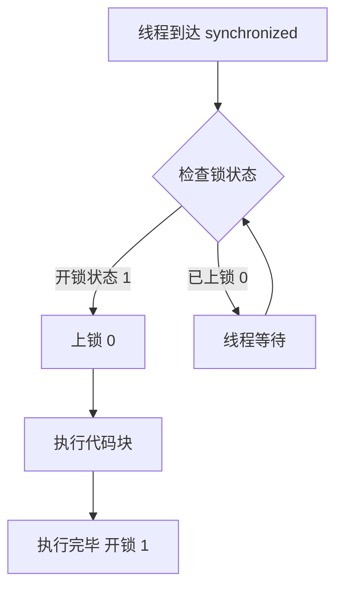

# 五斤锁（@synchronized）原理总结

## 🔒 核心原理

**每一个 Objective-C 对象内部都有一个隐含的锁变量**（类似于二进制信号量），用于实现线程同步。

## 🎯 工作原理（5个步骤）



### 详细流程：
1. **检查锁状态**：线程进入 `@synchronized(obj)` 时，检查 `obj` 的锁状态
2. **判断条件**：
   - 如果锁是 **开锁状态 (1)** → 进入步骤3
   - 如果锁是 **上锁状态 (0)** → 进入步骤5
3. **上锁**：将锁状态设为 **0**（上锁）
4. **执行代码**：执行 synchronized 代码块内的逻辑
5. **开锁**：代码块执行完毕，将锁状态恢复为 **1**（开锁）
6. **线程等待**：如果锁已被其他线程占用，当前线程进入**就绪状态**等待

## 📝 代码示例

```objective-c
// 使用 @synchronized
@synchronized(self) {
    // 这里是线程安全的代码区域
    self.sharedData = [self processData];
    [self updateCount];
}
```

## ⚖️ 优缺点分析

### ✅ 优点：
1. **简单易用**：语法简洁，无需手动管理锁
2. **自动管理**：自动加锁/解锁，避免死锁
3. **对象级锁**：不同对象可使用不同锁，提高并发性
4. **异常安全**：即使代码块抛出异常，锁也会正确释放

### ❌ 缺点：
1. **性能开销**：检查锁状态、线程等待增加额外开销
2. **效率降低**：串行执行代码块，降低并发性能
3. **可能死锁**：不当的嵌套使用可能导致死锁
```objective-c
// 错误示例：可能死锁
@synchronized(objA) {
    @synchronized(objB) {
        // 如果另一线程先锁 objB 再锁 objA，可能死锁
    }
}
```

## 🔧 底层实现

### 实际是转换为：
```objective-c
// @synchronized(obj) { ... } 实际上转换为：
objc_sync_enter(obj);
// 代码块...
objc_sync_exit(obj);
```

### 锁的数据结构：
```c
typedef struct {
    id object;          // 被锁的对象
    int threadCount;    // 等待线程数
    // 其他同步信息...
} SyncData;
```

## 🎪 使用场景对比

| 场景 | 是否使用 @synchronized | 理由 |
|------|----------------------|------|
| 简单数据保护 | ✅ 推荐 | 代码简洁，安全 |
| 高性能并发 | ❌ 不推荐 | 性能开销大 |
| 复杂锁逻辑 | ❌ 不推荐 | 功能有限 |
| iOS UI更新 | ❌ 不推荐 | 应使用 dispatch_async(主队列) |

## 💡 最佳实践

### 1. **选择正确的锁对象**
```objective-c
// 正确：为特定数据创建专用锁对象
@property (nonatomic, strong) NSObject *dataLock;

- (instancetype)init {
    if (self = [super init]) {
        _dataLock = [[NSObject alloc] init];  // 专用锁对象
        _sharedData = [NSMutableArray array];
    }
    return self;
}

- (void)addItem:(id)item {
    @synchronized(self.dataLock) {  // 使用专用锁
        [self.sharedData addObject:item];
    }
}
```

### 2. **避免锁嵌套**
```objective-c
// 避免这样
- (void)unsafeMethod {
    @synchronized(self) {
        // 一些操作...
        [self anotherMethod];  // 可能包含另一个 @synchronized(self)
    }
}

- (void)anotherMethod {
    @synchronized(self) {  // 危险：可能递归锁或死锁
        // ...
    }
}
```

### 3. **锁的范围最小化**
```objective-c
// 不好：锁范围太大
@synchronized(self) {
    id result = [self fetchFromDatabase];  // 耗时操作
    [self processResult:result];           // 处理数据
    self.displayText = result.description; // 更新属性
}

// 好：只锁必要的部分
id result = [self fetchFromDatabase];  // 无锁操作（如果不涉及共享数据）
@synchronized(self) {
    [self.sharedArray addObject:result];  // 只锁共享数据访问
}
dispatch_async(dispatch_get_main_queue(), ^{
    self.displayText = result.description;  // UI更新在主线程
});
```

## 🆚 与其他锁机制对比

| 锁类型 | 复杂度 | 性能 | 适用场景 |
|--------|--------|------|----------|
| `@synchronized` | ⭐ 简单 | ⭐⭐ 一般 | 简单同步 |
| `NSLock` | ⭐⭐ 中等 | ⭐⭐⭐ 较好 | 一般同步 |
| `dispatch_semaphore` | ⭐⭐⭐ 较复杂 | ⭐⭐⭐⭐ 好 | 资源计数 |
| `pthread_mutex` | ⭐⭐⭐⭐ 复杂 | ⭐⭐⭐⭐⭐ 优秀 | 高性能需求 |
| `OSSpinLock` | ⭐⭐ 中等 | ⭐⭐⭐⭐⭐ 极好 | iOS 10前高性能 |

## 📊 性能影响数据

| 操作 | 大概耗时 | 说明 |
|------|----------|------|
| 无锁访问 | ~0.001ms | 基础内存访问 |
| `@synchronized` 加锁 | ~0.05ms | 检查锁状态、线程切换 |
| 线程等待 | 0.1ms-∞ | 取决于其他线程执行时间 |
| 锁竞争严重时 | 性能下降 50-80% | 多个线程频繁争抢同一锁 |

## 🚀 现代替代方案

### 使用 GCD 队列替代：
```objective-c
// 创建串行队列用于同步
@property (nonatomic, strong) dispatch_queue_t syncQueue;

- (instancetype)init {
    if (self = [super init]) {
        _syncQueue = dispatch_queue_create("com.example.sync", DISPATCH_QUEUE_SERIAL);
        _sharedData = [NSMutableArray array];
    }
    return self;
}

- (void)addItem:(id)item {
    dispatch_sync(self.syncQueue, ^{
        [self.sharedData addObject:item];
    });
}
```

## 🎓 关键记忆点

1. **"五斤"** = "物镜" → 每个**对象**都有锁
2. **二进制状态**：1=开锁（可进入），0=上锁（需等待）
3. **自动管理**：进入自动上锁，退出自动开锁
4. **性能代价**：安全 vs 效率的权衡
5. **现代开发**：优先考虑 GCD/NSOperation

## ⚠️ 常见错误

```objective-c
// 错误1：锁 nil 对象（无效）
@synchronized(nil) {  // 对 nil 加锁无效！
    // 这里不是线程安全的
}

// 错误2：频繁小操作加锁（性能差）
for (int i = 0; i < 1000; i++) {
    @synchronized(self) {  // 1000次加锁/解锁！
        [self.array addObject:@(i)];
    }
}

// 正确：批量操作一次加锁
@synchronized(self) {
    for (int i = 0; i < 1000; i++) {
        [self.array addObject:@(i)];
    }
}
```

**总结**：`@synchronized` 是 Objective-C 中最简单易用的线程同步机制，适合保护小段关键代码，但在高性能场景应考虑更高效的替代方案。